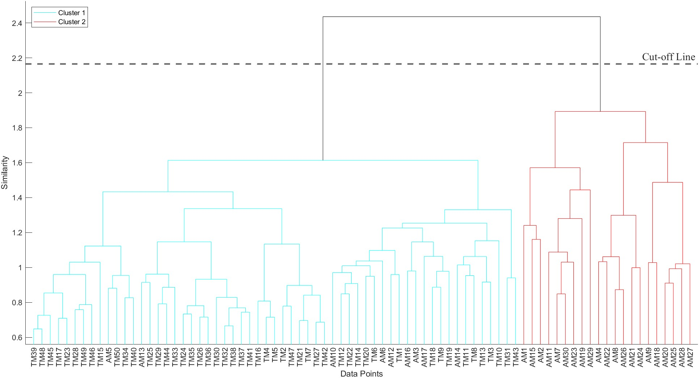

# **User's Guide**

## HICA: A MATLAB-based Hierarchical Image Clustering Algorithm for Classifying Parts Suitable for Additive and Traditional Manufacturing Technologies

### Brief Description of HICA
HICA is a software tool developed in MATLAB, specifically designed to differentiate parts suitable for additive and traditional manufacturing technologies based on part geometry only. The software tool can classify image datasets, CAD datasets, and combined datasets with both images and CAD models. The tool can reduce time and effort spent for selecting a manufacturing process by providing a preselected set of parts that are more suitable for additive manufacturing. The software is aimed to support decision making for traditional manufacturing companies that consider expanding their production capabilities by introducing additive manufacturing processes to their production portfolio.
### System Requirements
HICA is developed using a CAD software and MATLAB R2022b; hence, system requirements are identical to those required for MATLAB. The following toolboxes should be installed before running the HICA:
-	Statistics and Machine Learning Toolbox
-	Computer Vision Toolbox 
-	Image Processing Toolbox

It is recommended to install the newest version of MATLAB software.

In case of using CAD models as inputs, the HICA requires a CAD processing software with the following properties:

-	The CAD tool is able to export images of CAD models automatically (e.g., SolidWorks Task Scheduler)
-	The default template of the CAD tool is set to have no shadow and no background graphics.

### Instructions to Run the Software
**Step 1:** Ensure you have the newest version of MATLAB and a CAD software are installed on your computer. Install the aforementioned toolboxes as MATLAB add-ins. Then, use the CAD software you have installed in your computer to extract images from CAD models. Below you can find the steps to export images using SOLIDWORKS Task Scheduler, but you can use another CAD software to acquire the images.
-	Open SOLIDWORKS and set the default template properties as no background and no shadow
-	Open SOLIDWORKS Task Scheduler
-	Select the folder that contains the CAD models
-	Specify the extracted file type as image (e.g., jpeg or PNG)
-	Specify the folder to save the extracted images

**Step 2:** Open **HICA.m** file from the directory. The HICA.m file is shown in Figure 1. The HICA.m file contains the code that inserts images and classifies them. This code is responsible for the functionality of the software, so it is important to avoid making unexpected changes to the source code unless you have a good understanding of the implications of those changes.

Note: The proposed software was configured by default to operate with .JPG images. However, additional image formats such as .PNG, .TIFF among others are supported, if they are not encrypted.

Figure 1. The display of the HICA.m file

  **Step 3:** After opening the HICA.m, specify the location of the image folder by copying it from your computer’s directory. Simply, paste the image folder directory to replace the highlighted text in Figure 2. 

Figure 2. Arguments section of HICA.m file with image directory highlighted

**Step 4:** Insert the cluster number instead of the highlighted text shown in Figure 3. The HICA algorithm can generate up to 5 clusters of parts.

Figure 3. Argument section of HICA.m with cluster number highlighted

Then, to execute HICA.m, simply click on the "run" button in the MATLAB environment. After executing the code, the HICA.m will generate up to six figures based on the cluster number selected in this step. The following figures are the outputs of the algorithm:

-	Figure 1: Resulting dendrogram with different clusters
-	Figure 2: Images that are in Cluster 1
-	Figure 3: Images that are in Cluster 2
-	Figure 4: Images that are in Cluster 3
-	Figure 5: Images that are in Cluster 4
-	Figure 6: Images that are in Cluster 5

The algorithm also saves and exports an “.XLSX” file containing clusters of each image in the dataset.

**EXAMPLE:** Clustering 40 parts that contain CAD and JPG files, 15 CAD models and 25 Images.

**Step 1: **Latest version of MATLAB R2023b is installed and the Statistics and Machine Learning Toolbox, Computer Vision Toolbox, and Image Processing Toolbox are installed as add-ins to MATLAB. SolidWorks Task Scheduler is used to convert CAD models into images as shown in Figure 4. Here, click on Export Files (highlighted in Figure 4).

Figure 4. SOLIDWORKS Task Scheduler

Then, the Export File window will open as shown in Figure 5. Select the folder that contains the CAD models and specify the file type as an image (e.g., .JPG or .PNG). Finally, click Finish. The Task Scheduler will automatically export images into the same folder. Alternatively, you can specify another folder to store the exported images.

Figure 5. Export file window of SOLIDWORKS Task Scheduler

**Step 2:** Download and open the file HICA.m.

**Step 3:** Specify the image folder as mentioned above.

**Step 4: ** Specify the desired cluster number. In this example, we have selected the desired cluster number as 2. Then, the code is executed by clicking on Run in MATLAB.

Finally, the following figures are obtained. Figure 6 shows the resulting dendrogram. Figures 7 and 8 show resulting cluster 1 and cluster 2, respectively.

Figure 6. Dendrogram

Figure 7. Cluster 1

Figure 8. Cluster 2

## LICENSE

GNU General Public License v3.0
